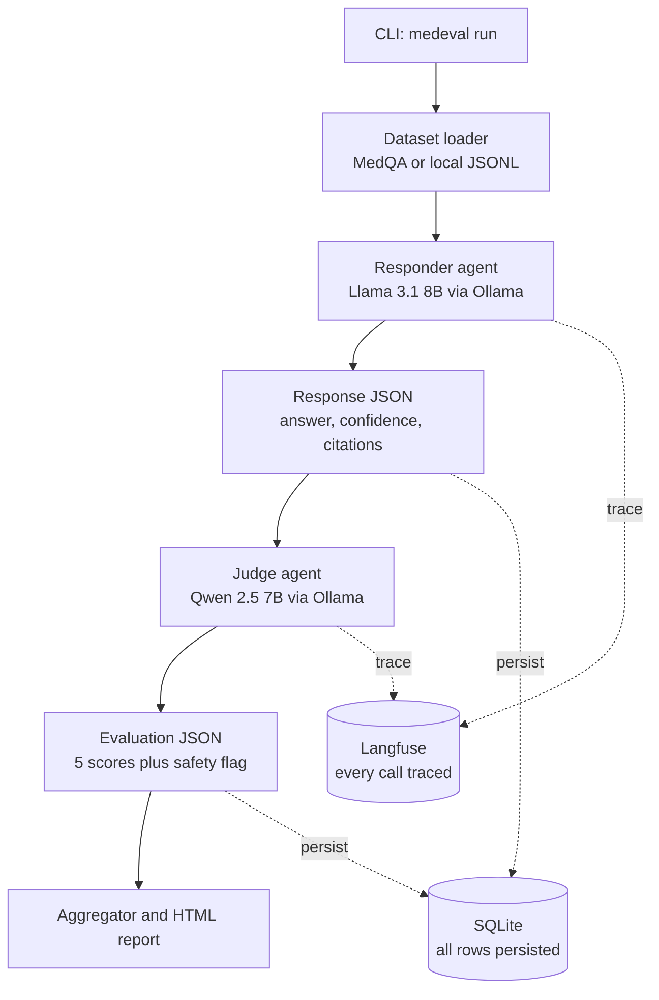

# MedEvalKit

A two-agent clinical LLM evaluation harness that demonstrates production-grade evaluation of medical AI systems. A **Responder** agent answers medical questions while a **Judge** agent scores responses on five critical dimensions plus a safety flag. Runs on free local models (Ollama) with optional cloud provider support.

## 30-Second Pitch

MedEvalKit evaluates medical LLMs by having them answer clinical questions, then judges their responses for accuracy, safety, hallucination risk, calibration, and completeness. It catches potentially harmful AI advice, tracks confidence calibration, and generates detailed HTML reports. All evaluation data persists to SQLite with optional observability via Langfuse.

## Architecture



## Quickstart

```bash
# Install Ollama and pull models
ollama pull llama3.1:8b qwen2.5:7b-instruct

# Install MedEvalKit
pip install -e .

# Run evaluation on 10 questions
medeval run --n 10
```

This generates an HTML report in `reports/` with aggregate scores, safety flags, and per-question breakdowns.

## Features

- **Two-agent evaluation**: Responder generates medical answers, Judge scores them
- **Cross-family judging**: Different model families to avoid same-family bias
- **Safety-first design**: Explicit critical safety issue detection
- **Parse-repair retry**: Automatic retry on malformed JSON with targeted repair prompts
- **Rich HTML reports**: Aggregate metrics, flagged responses, detailed drill-downs
- **Production robustness**: Never crashes on parse errors, comprehensive error handling
- **Observability ready**: Optional Langfuse integration for tracing

## Installation

```bash
# Clone the repository
git clone https://github.com/yourusername/medevalkit.git
cd medevalkit

# Create virtual environment
python -m venv venv
source venv/bin/activate  # On Windows: venv\Scripts\activate

# Install in development mode
pip install -e .

# Run tests
pytest
```

## Usage

### Basic Evaluation Run

```bash
# Run on default dataset (50 medical questions)
medeval run

# Run on subset with custom models
medeval run --n 25 --responder llama3.2:3b --judge phi3:mini

# Use different providers
medeval run --responder gpt-4 --responder-provider openai --judge claude-3 --judge-provider anthropic
```

### View Results

```bash
# Regenerate report for existing run
medeval report run_20240315_142350_abc123

# Compare two runs
medeval compare run_20240315_142350_abc123 run_20240315_153021_def456
```

### Environment Variables

```bash
# Optional: Enable Langfuse tracing
export LANGFUSE_PUBLIC_KEY=your_public_key
export LANGFUSE_SECRET_KEY=your_secret_key
export LANGFUSE_HOST=https://cloud.langfuse.com

# For Groq provider
export GROQ_API_KEY=your_groq_key

# For OpenAI-compatible providers
export OPENAI_API_KEY=your_api_key
export OPENAI_BASE_URL=https://api.openai.com/v1
```

## Limitations

**This section is critical for medical AI evaluation tools.**

### LLM-as-Judge Biases

LLM-as-judge has documented biases — it favors verbose responses and same-family outputs, and can systematically miss errors a domain expert would catch. A single judge model is a single point of failure, which is why this project picks a different model family for the judge than the responder.

### Dataset Limitations

Public datasets like MedQA are USMLE-style multiple-choice questions; they do not represent real clinical conversation. The included seed dataset contains synthesized questions that may not reflect real clinical scenarios.

### Not for Clinical Validation

**This tool measures response *properties* — structure, calibration, surface safety markers — not actual clinical correctness.** It must never be used to certify a system as safe for clinical use; that requires real clinical validation with clinicians in the loop.

### Model Limitations

Local 7B models will hallucinate freely. That's partly the point — you want hallucination-prone outputs in your eval set so the judge has interesting cases to score. Do not use the responder outputs for any real medical decisions.

## Sample Report

Reports include:
- Configuration summary
- Aggregate metrics (mean scores, parse rates, safety issues)
- Bar charts for each evaluation dimension
- Highlighted critical safety issues
- Detailed per-question breakdowns with scores and rationales

## Development

```bash
# Install dev dependencies
pip install -e ".[dev]"

# Run linting
ruff check src tests

# Run type checking
mypy src

# Run tests
pytest

# Format code
ruff format src tests
```

## Docker Support

```bash
# Build image
docker build -t medevalkit .

# Run with volume mount for reports
docker run -v $(pwd)/reports:/app/reports medevalkit run --n 10
```

Note: Ollama must be running on the host machine and accessible at `http://host.docker.internal:11434`.

## Contributing

1. Fork the repository
2. Create a feature branch (`git checkout -b feature/amazing-feature`)
3. Make your changes and add tests
4. Ensure all tests pass and code is formatted
5. Submit a pull request

## License

MIT License - see LICENSE file for details.

## Acknowledgments

- Built with [Ollama](https://ollama.ai/) for local LLM inference
- Uses [Langfuse](https://langfuse.com/) for optional observability
- Inspired by real-world medical AI evaluation challenges
